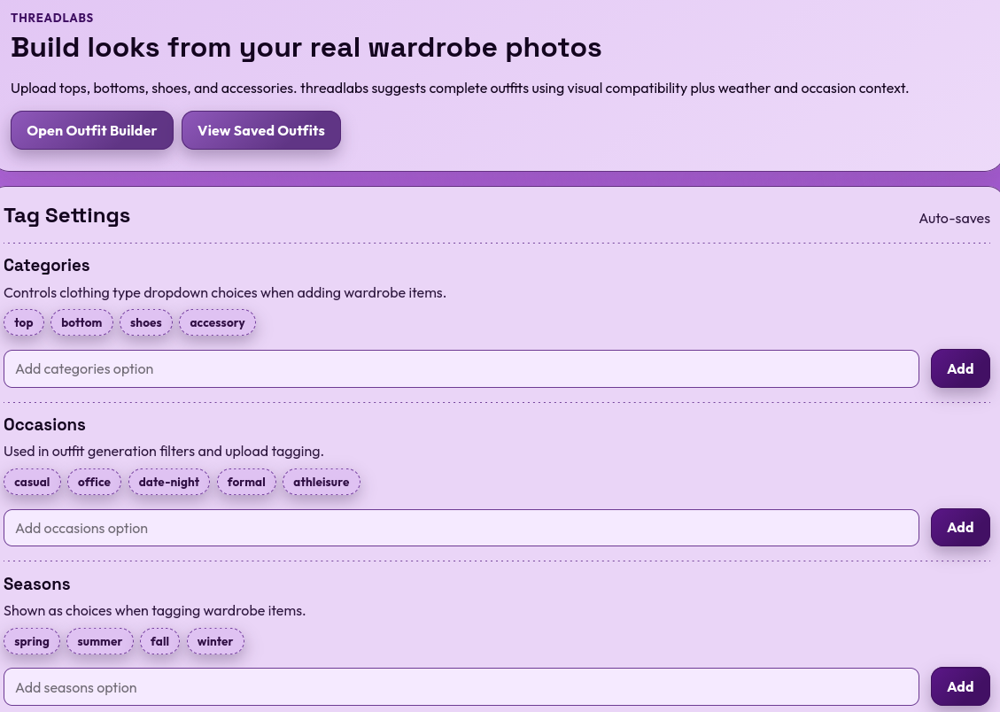
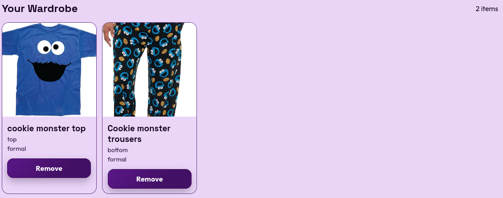
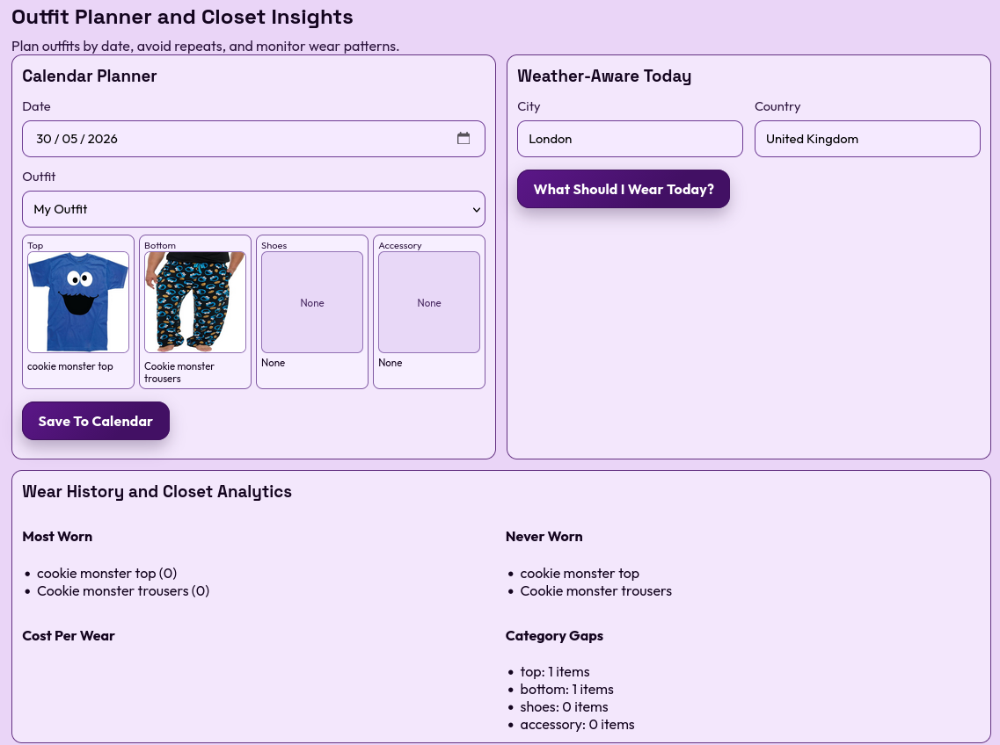
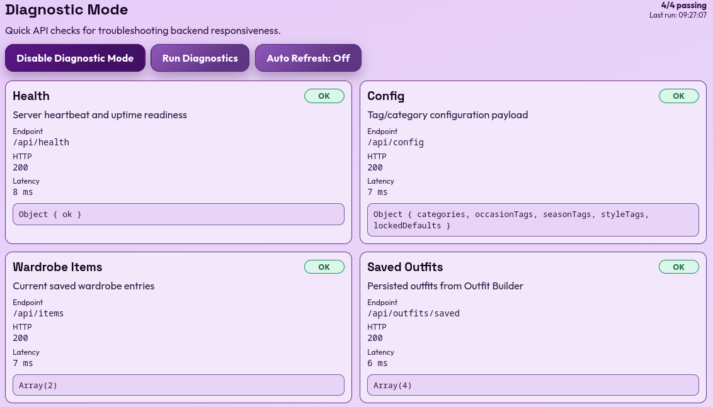

# ThreadLabs

Build outfits from your real wardrobe photos, then plan, track, and improve what you wear.

ThreadLabs combines a visual outfit recommender, a graph-based builder, weather-aware daily picks, and wardrobe analytics in one local-first app.

## Screenshots

### Home and settings



### Wardrobe grid



### Planner and analytics



### Diagnostics mode



## What it is

- Photo-first wardrobe manager
- Outfit suggestions with weather + feedback-aware scoring
- Pure canvas Outfit Builder (LiteGraph) with constraints and variation generation
- Saved outfit library with edit/duplicate flow
- Planner + repeat avoidance + daily recommendation
- Wear analytics and diagnostics panel for API health

## Core Features

### Wardrobe and tagging

- Upload items with image, category, seasons, occasions, styles, and warmth
- Configurable tag system (categories, occasions, seasons, styles)
- Default tags are locked; custom tags are persistent and removable


### Outfit generation

- Suggest outfits from inventory
- One-click random outfit
- Missing-category detection with smart "what to buy" hints
- Like/skip feedback improves ranking over time

### Outfit Builder (Graph Lab)

- Node-based canvas for building named outfits
- Item lock behavior for pinned selections
- Constraint node (formality, warmth range, no-repeat behavior)
- Build 3 Variations node
- Validation badges (missing required item, category mismatch, low confidence)
- Compare mode tray for side-by-side variation review

### Saved outfits

- Save built outfits
- Edit mode: rename, swap items, resave
- Duplicate outfit as a new variant

### Planner and insights

- Calendar planner for assigning outfits to dates
- Repeat-avoidance for recent plans
- Weather-aware "What should I wear today?"
- Wear logging and analytics:
	- most worn
	- never worn
	- cost per wear (for items with a cost value)
	- category gaps


### Diagnostics mode

- Bottom-of-home diagnostics panel
- Endpoint checks with latency and status:
	- `/api/health`
	- `/api/config`
	- `/api/items`
	- `/api/outfits/saved`


## Tech Stack

- Frontend: React + Vite + React Router
- Backend: Node.js + Express + Multer
- Canvas graph: LiteGraph.js
- Persistence: local JSON database (`server/data/db.json`) + local uploads (`server/uploads`)

## Project Structure

```text
threadlabs/
	server/
		src/
		data/db.json
		uploads/
	web/
		src/
```

## Run locally

1. Install dependencies

```bash
npm install
```

2. Start API + web app

```bash
npm run dev
```

3. Open

- App: http://localhost:5173
- API: http://localhost:4000

## Build

```bash
npm run build
```

## Environment

Copy `server/.env.example` to `server/.env` if needed.

- `PORT` (default: `4000`)
- No API keys are required for local setup

## API Highlights

- `GET /api/items`
- `POST /api/items`
- `DELETE /api/items/:id`
- `POST /api/suggestions`
- `GET /api/outfits/random`
- `GET /api/outfits/saved`
- `POST /api/outfits/saved`
- `PUT /api/outfits/saved/:id`
- `POST /api/outfits/saved/:id/duplicate`
- `GET /api/planner`
- `POST /api/planner`
- `DELETE /api/planner/:id`
- `POST /api/wear-log`
- `GET /api/analytics`
- `POST /api/recommendation/daily`
- `GET /api/health`
